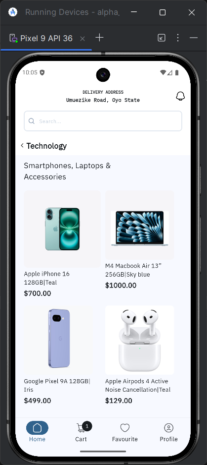
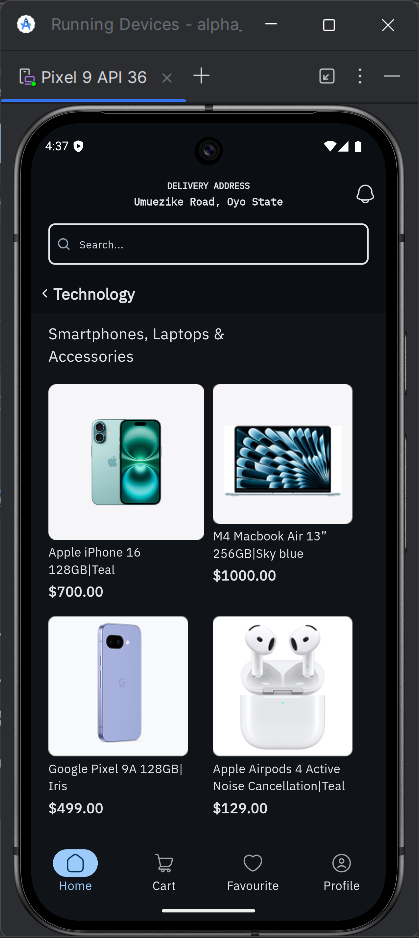
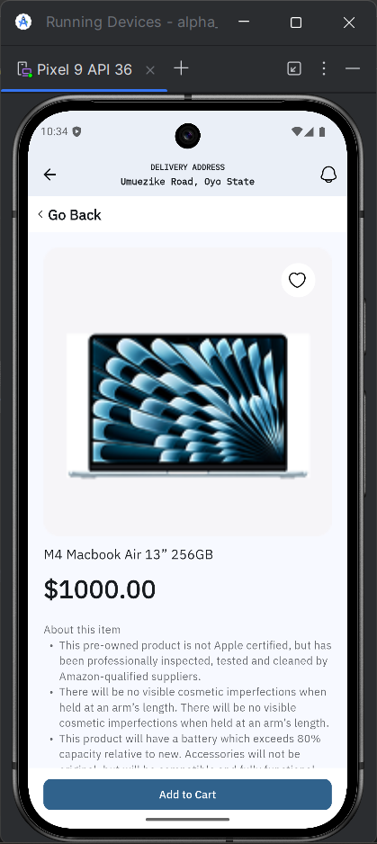
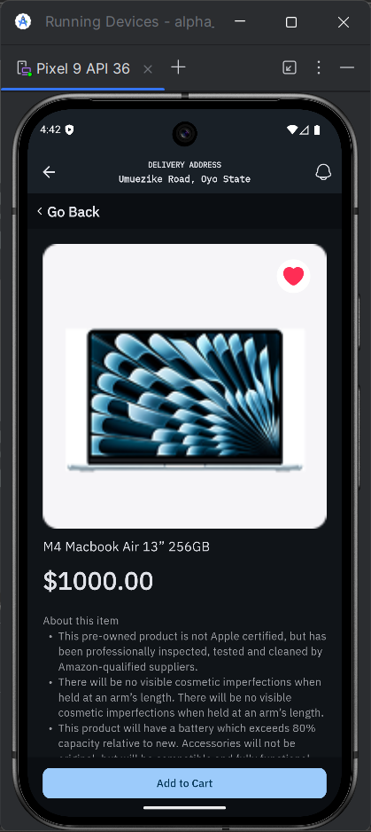
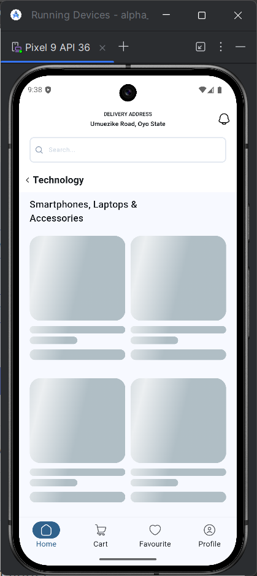
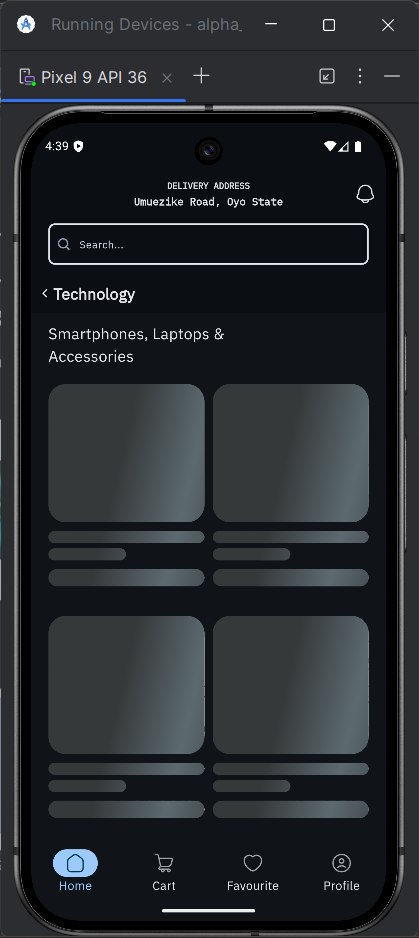

# AlphaTwelveTask


A Flutter e-commerce app with product browsing, detailed views, and cart functionality.

## Features

- ✅ Browse a list of products
- ✅ View detailed product information
- ✅ Add products to cart
- ✨ Light/Dark theme support
- ✨ Shimmer loading effects

## Screenshots

| Light Mode                              | Dark Mode                             |
|-----------------------------------------|---------------------------------------|
|     |     |
|  |  |

## Shimmer Effects

| Light Shimmer                           | Dark Shimmer                          |
|-----------------------------------------|---------------------------------------|
|  |  |

## Getting Started

### Prerequisites

- Flutter SDK (>=3.0.0)
- Dart (>=2.17.0)

### Installation

1. Clone the repository:
```bash
git clone https://github.com/lordBman/alph_twelve_task.git
cd AlphaTwelveTask
```
2. Install dependencies:
```bash
flutter pub get
```
3. Check available Android Emulator or Connected Physical Mobile Device
```bash
flutter devices
```

4. Run the app on desired Android Device
```bash
flutter run -d <device-name-from-device-list-earlier>
```

## Running Tests

### Run all test
```bash
flutter test
```

### Run tests with coverage
```bash
flutter test --coverage
genhtml coverage/lcov.info -o coverage/html
open coverage/html/index.html
```


